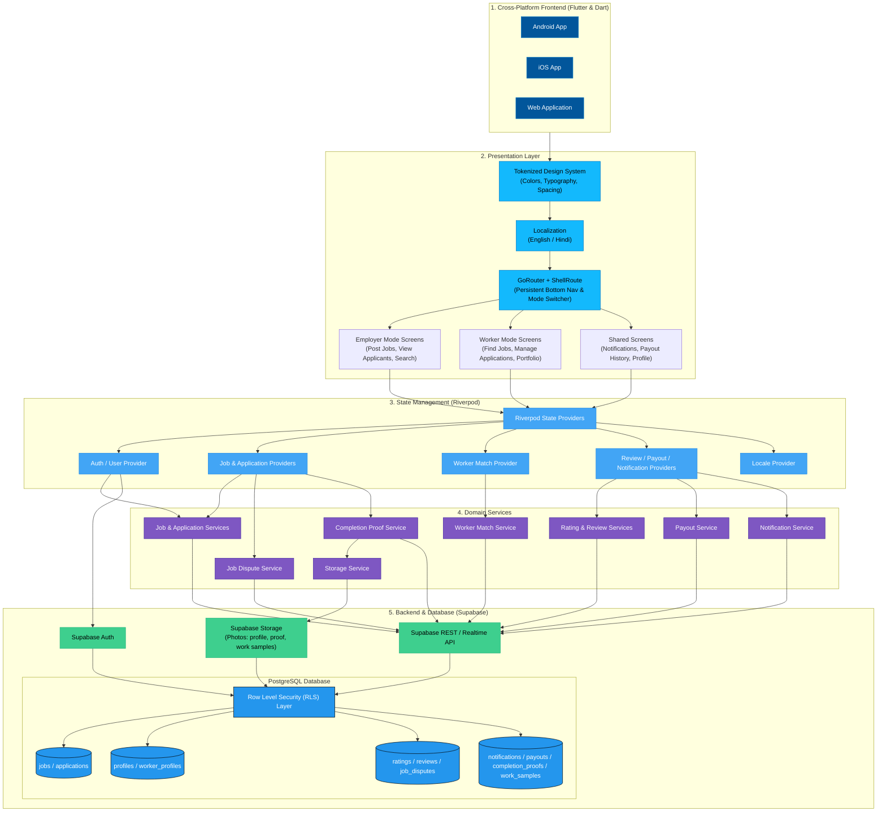

# KaamSetu — Daily Workforce Dispatch & Operations Platform

KaamSetu (*Bridge to Work*) is a real-time daily workforce dispatch platform built for India's unorganized daily-wage market. It connects households and local businesses directly with verified daily-wage workers (painters, plumbers, cleaners, cooks, electricians, gardeners) for immediate daily jobs.

---

## The Problem & What KaamSetu Solves

### The Problem
Finding reliable daily help for short 1-day tasks (e.g. painting a living room, deep kitchen cleaning, tap repair) in Indian cities remains fragmented:
* **For Households**: Unreliable word-of-mouth recommendations, zero background verification, and arbitrary daily pricing.
* **For Workers**: Unpredictable daily work, middleman commission cuts (up to 30%), and no permanent record or reputation history.

### The Solution
KaamSetu digitizes daily labor dispatch into a clean, mobile-first experience:
1. **60-Second Dispatch**: Households create a daily job posting with task requirements and daily rates. Nearby verified workers receive notifications instantly.
2. **Dual-Mode Architecture**: Users can switch seamlessly between **Employer Mode** (posting jobs) and **Worker Mode** (finding daily work) inside the exact same app session with a single tap.
3. **Direct Connection & Verification**: Worker profiles display Aadhaar verification badges and skill tags. Phone numbers unlock once a worker is assigned to a job.
4. **Transparent Rates**: Jobs list upfront daily pay rates with zero middleman deductions.
5. **Trust Loop, End to End**: Every job now runs through a full lifecycle — post → match → assign → complete with photo proof → rate → get paid — instead of stopping at assignment.

---

## What's Built in the Repo Today

* **Product Landing & Auth**: Splash screen, dedicated Sign In / Sign Up screens, and an OTP verification UI (`otp_verification_bottom_sheet`) with countdown resend timers and toast alert feedback. The OTP flow currently runs in a hardcoded/demo mode (no live SMS provider wired up yet) rather than sending real one-time codes.
* **Dual-Mode Dashboard**: Live stats pulled from Supabase (`dashboard_stats_service`) instead of static placeholders — active postings, category distribution, and job dispatch triggers for Employer Mode; availability, sector radius, and expected daily wage for Worker Mode.
* **Job Dispatch Ledger & Search**: Full-screen job search with real-time text query filtering, a dedicated `SearchScreen`, filterable results (`filter_provider`, `filter_bottom_sheet`), modal category selector (`AppBottomSheet`), and tabbed status management (`OPEN`, `ASSIGNED`, `COMPLETED`).
* **Worker Matching Engine**: `worker_match_service` ranks and surfaces nearby workers for a posted job using distance, skill fit, and rating signals.
* **4-Stage Job Stepper + Completion Proof**: Visual progress tracker (`Posted` → `Interested` → `Assigned` → `Completed`) with task specs, applicant worker cards, a sticky bottom action bar, and a photo-based completion proof flow (`completion_proof_service` + `image_picker`) so jobs are marked done with evidence, not just a tap.
* **Ratings, Reviews & Disputes**: Thumbs-up/down rating capture (`rating_service`, `thumbs_rating_bottom_sheet`), written reviews (`review_service`), a rating breakdown widget, and a job dispute / "report issue" flow (`job_dispute_service`, `report_issue_bottom_sheet`) for when a job doesn't go as planned.
* **Payouts & Earnings**: `payout_service` plus a dedicated Payout History screen so workers can track what they've earned per completed job.
* **In-App Notifications**: `notification_service` and a Notifications screen deliver real-time updates for job matches, assignments, ratings, and disputes, backed by a live `notifications` table.
* **Worker Portfolio & Storage**: `work_sample_service` lets workers upload photos of past work; `storage_service` handles all image uploads to Supabase Storage (profile photos, work samples, completion proof).
* **System Profile & Skills Management**: Worker profile editor to toggle availability (`available` / `busy`), customize skill badges, view ratings/reviews, and manage a saved address book (`address_bottom_sheet`).
* **Bilingual Support**: Full English + Hindi localization via `flutter_localizations` and `.arb` files, with a `locale_provider` so users can switch languages at runtime.
* **Design System**: Custom Flutter design tokens (`AppColors.canvas`, `AppColors.surface`, `AppColors.brand`) on a light, warm-neutral canvas, with strict single-accent color discipline — the amber CTA accent has since evolved into a warm maroon (`#943D39`) reserved for primary CTAs, active states, and prices.
* **Real Supabase Backend**: A versioned Postgres schema (`supabase/schema.sql`) and migration history covering profiles, worker profiles, jobs, applications, ratings, reviews, notifications, payouts, job disputes, completion proofs, and work samples — all behind Row Level Security — plus a seed script (`bin/seed_runner.dart`) for populating demo data.
* **Test Coverage**: Widget and integration tests covering the full application loop, job posting, OTP verification edge cases, profile persistence, locale switching, and rating flows.

---

## Tech Stack

| Layer | Library / Tool | Version | Purpose |
| :--- | :--- | :--- | :--- |
| **Framework** | Flutter | `^3.24.0` | Cross-platform native mobile application engine |
| **Language** | Dart | `^3.5.0` | Strongly-typed OOP language for UI and logic |
| **State Management** | Flutter Riverpod | `^2.6.1` | Reactive, compile-safe state management |
| **Navigation** | GoRouter | `^14.8.0` | Declarative URL-friendly routing with `ShellRoute` |
| **Typography** | Google Fonts | `^6.2.1` | Sora (headlines/titles) & Inter (body text) |
| **Animations** | Flutter Animate | `^4.5.2` | Fluid micro-interactions & press scale feedback |
| **Database, Auth & Storage** | Supabase Flutter Client | `^2.8.0` | PostgreSQL client, Auth, Realtime, and file storage with Row Level Security (RLS) |
| **Localization** | `flutter_localizations` + `intl` | `^0.20.2` | English + Hindi bilingual support |
| **Media** | `image_picker` | `^1.2.3` | Capturing/uploading completion proof & work sample photos |
| **Persistence** | `shared_preferences` | `^2.3.2` | Lightweight local state (locale choice, onboarding flags) |
| **Utilities** | `url_launcher` | `^6.3.0` | Direct calling of assigned worker/employer phone numbers |
| **Formatting** | `timeago` | `^3.7.0` | Human-readable relative timestamps ("2 hours ago") |

---

## System Architecture



## Project Structure

```
Tech-Rush-MVP/
├── assets/                     # Static image assets & app icons
│   └── images/                 # KaamSetu painter mascot logos
├── android/                    # Native Android Gradle configuration
├── ios/                        # Native iOS Xcode workspace & Runner app
├── linux/ macos/ windows/ web/ # Additional Flutter platform targets
├── bin/                        # Standalone Dart scripts (DB seeding, manual test traces)
│   └── seed_runner.dart        # Programmatic Supabase demo-data seeder
├── supabase/                   # Backend schema, migrations & seed data
│   ├── schema.sql              # Consolidated Postgres schema (source of truth)
│   ├── seed.sql                # Demo seed data (jobs, profiles, ratings, etc.)
│   └── migrations/             # Chronological migration history (RLS, tables, fixes)
├── lib/                        # Core Flutter application source code
│   ├── main.dart               # App entry point, Supabase init & ProviderScope setup
│   ├── core/                   # Design system tokens, theme, formatters, spacing
│   ├── l10n/                   # English & Hindi .arb translations + generated localizations
│   ├── models/                 # Strongly-typed Dart data models (Job, Worker, Rating, Payout, etc.)
│   ├── providers/               # Riverpod providers (auth, jobs, matches, reviews, locale, payouts)
│   ├── routing/                 # GoRouter route declarations & ShellRoute
│   ├── screens/                 # Modular UI screens (Splash, Auth, Dashboard, Search, Job Detail, Notifications, Profile, Payouts)
│   ├── services/                 # Supabase-backed domain services (jobs, matching, ratings, reviews, payouts, notifications, disputes, storage)
│   └── widgets/                  # Reusable UI widgets (ServiceCard, StatusChip, Logo, rating & dispute bottom sheets, etc.)
├── test/                        # Flutter unit, widget & integration tests
├── l10n.yaml                    # Localization codegen configuration
└── pubspec.yaml                 # Flutter project dependencies & asset definitions
```
